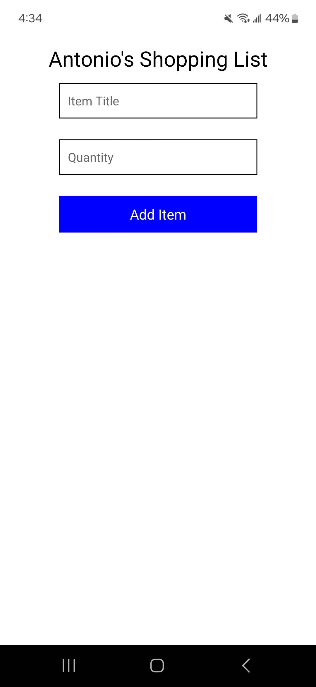
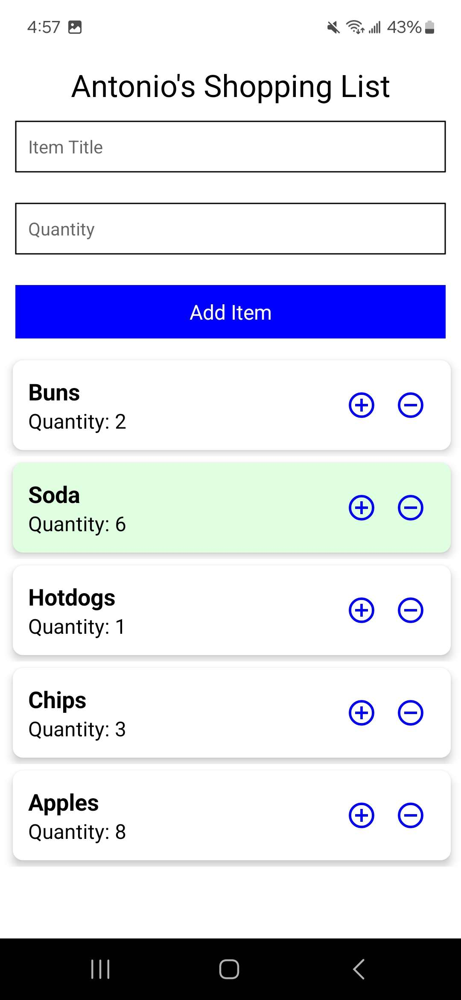
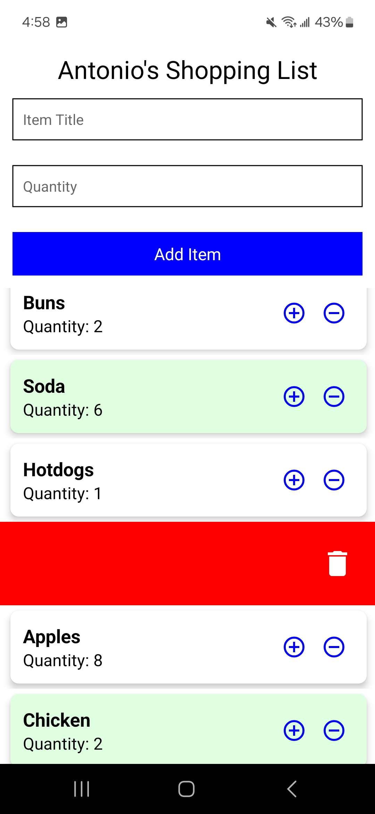
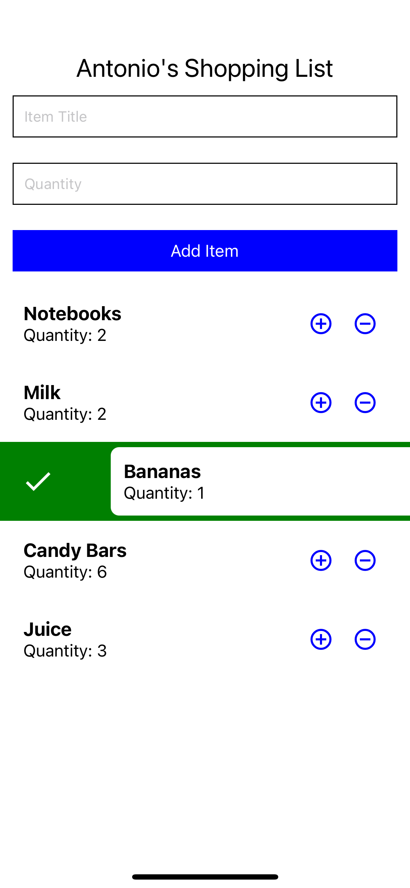
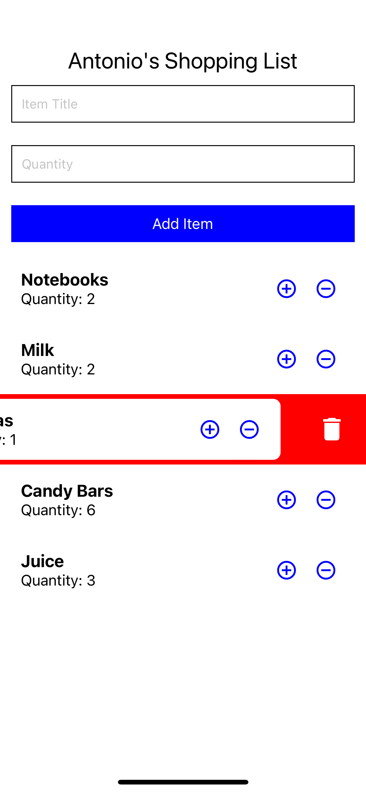

# Midterm Project - Shopping List application

This project is a Shopping List application built using React Native that allows users to add, view, edit, and delete their shopping items from the list. It includes React native concepts such as component-based architecture, state management, prop drilling, and user interaction.

updating readme documentation later..

## Features

- Add Items: Users can add items to their shopping list
- Users can view their shopping list and increase/decrease accordingly the quantity with a counter
- They can use the swipe action gesture to show they acquired or remove the item from their list
- The application is responsive to different screens on apple, android, and web views

## Prerequisite / Built With

- React Native to ensure cross-platform functionality on mobile platforms
- Expo used to develop and test the application
- JavaScript

## Setup / How to Tun

1. Clone the repo using `git clone ...`.
2. Open the project directory and install the dependencies and run using `expo start or npm start`.

## Gallery

Android view 

iPhone view

Web view

## Future Work

- Adding additonal fields such as Price
- More UI enhancements
- Better swipe/gestures
